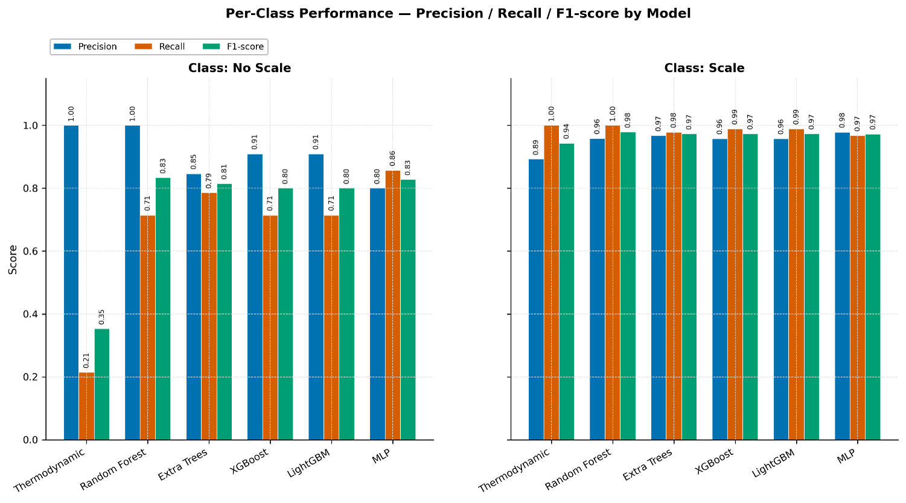
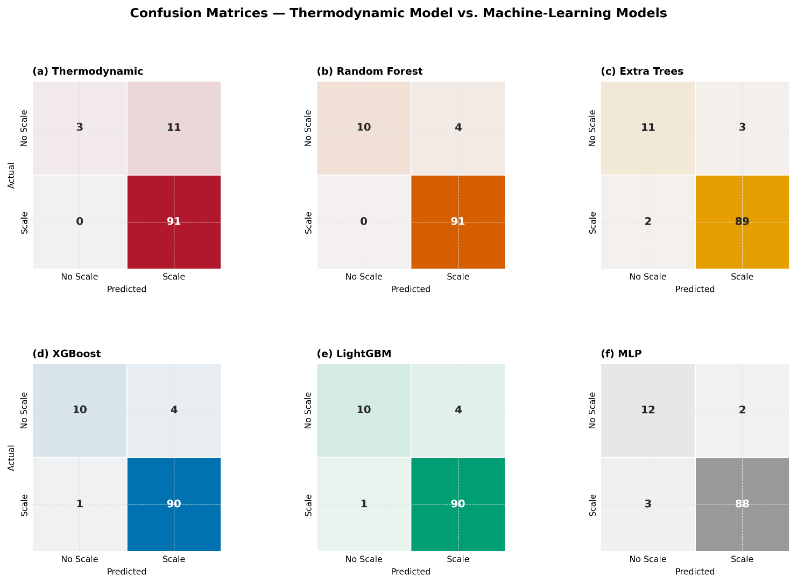
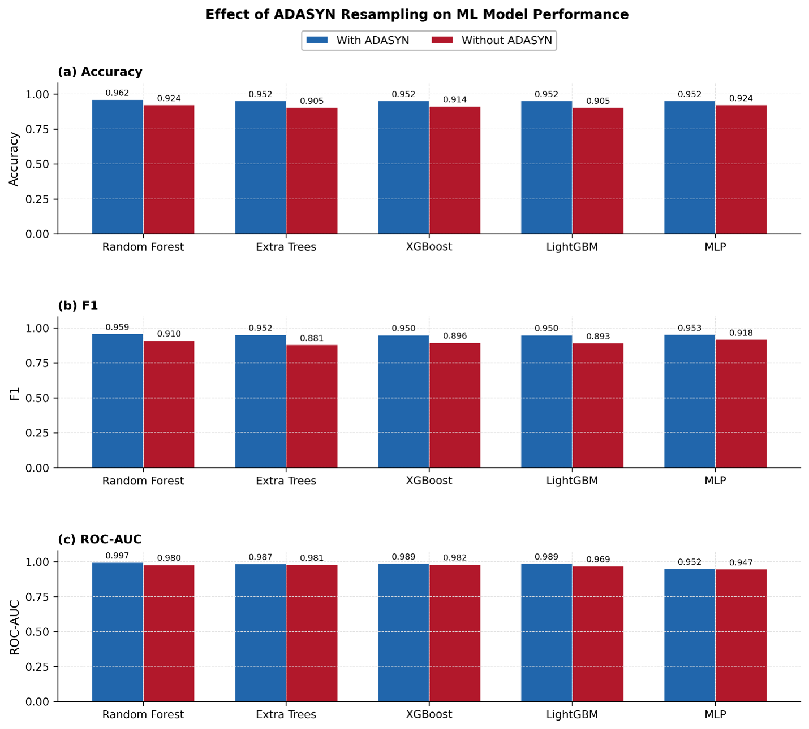
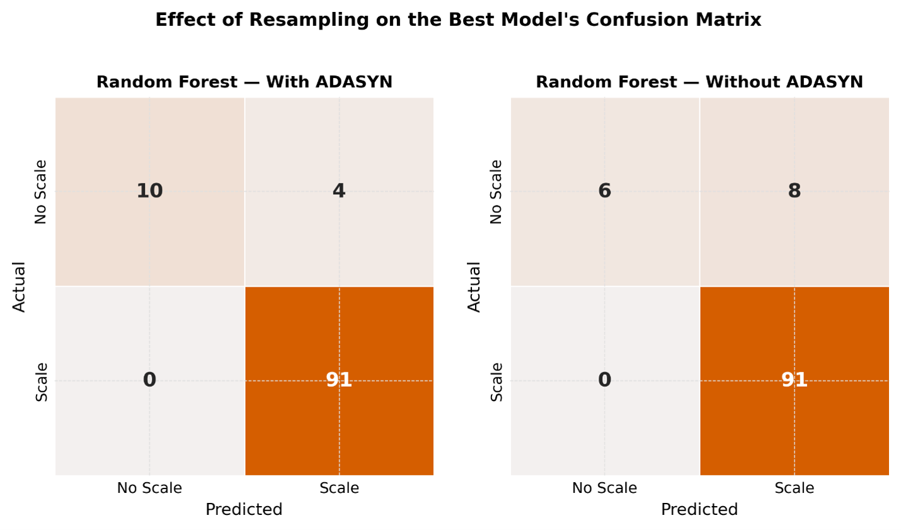
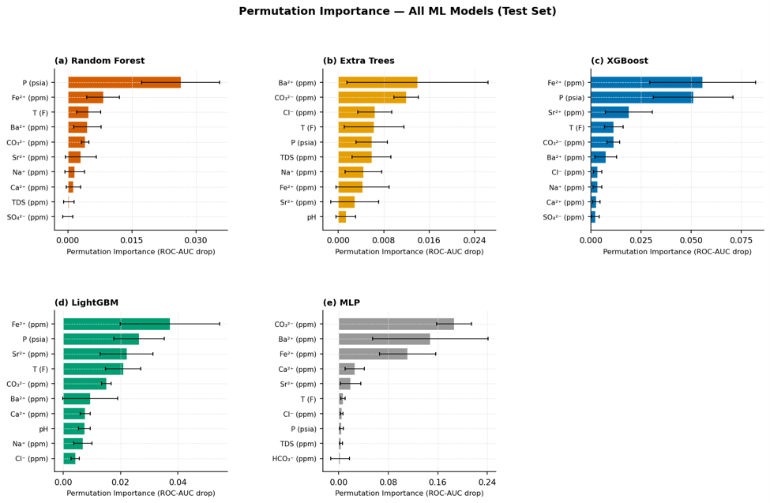
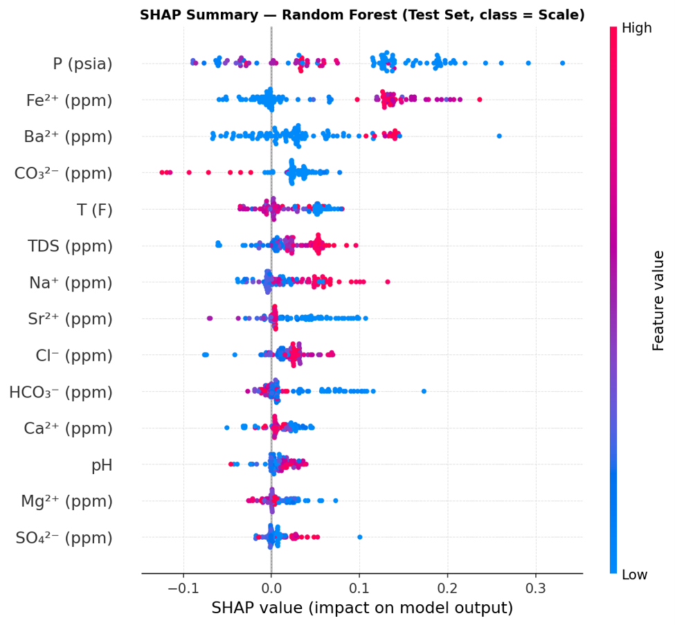

<div align="center">

# Mineral Scale Prediction — Thermodynamic Baseline vs. ML Ensemble

*A reproducible machine-learning pipeline for binary scale-risk classification from*
*produced-water chemistry, benchmarked against a physics-based thermodynamic saturation model.*

[](https://www.python.org/)
[](https://scikit-learn.org/)
[](https://xgboost.readthedocs.io/)
[](https://lightgbm.readthedocs.io/)
[](https://optuna.org/)
[](https://shap.readthedocs.io/)

</div>

---

## Overview

Mineral scaling — the precipitation of calcite, barite, and celestite from produced water — is a persistent flow-assurance hazard that can choke wellbores, foul surface facilities, and drive costly workover campaigns. Conventional risk screening relies on **thermodynamic saturation modeling** (Saturation Index / Saturation Ratio), which is physically grounded but often brittle in the field, since it depends on accurate activity-coefficient corrections and can miss risk regimes not captured by simple Ksp thresholds.

This repository implements a full binary-classification pipeline that predicts scale occurrence (`Scale` vs. `No Scale`) directly from produced-water composition and P/T conditions, and benchmarks five tuned ML classifiers against a **naive thermodynamic saturation-index baseline** computed from first principles (ionic strength, Davies activity coefficients, temperature-dependent Ksp for calcite, barite, and celestite).

The pipeline is self-contained end-to-end: it trains and tunes every model, evaluates everything on a held-out test set, **saves every fitted model to disk**, then reloads them from disk and reproduces every table and figure a second time — proving the saved artifacts alone are sufficient to regenerate the paper's results without repeating hyperparameter search.

---

## Methodology

### Thermodynamic Baseline

A naive Saturation Index (calcite) / Saturation Ratio (barite, celestite) model is computed per sample from ionic concentrations, pH, and temperature:

- Ionic strength `I = 0.5 · Σ cᵢzᵢ²` from all major ions (Ca²⁺, Na⁺, Mg²⁺, Fe²⁺, HCO₃⁻, SO₄²⁻, Cl⁻, CO₃²⁻, Ba²⁺, Sr²⁺)
- Carbonate concentration back-calculated from bicarbonate and pH
- A sample is flagged `Scale` if calcite SI > 0 **or** barite/celestite SR > 1

The Davies activity-coefficient correction and temperature-dependent Ksp machinery (calcite, barite, celestite) are retained in the code for methodological completeness but are excluded from the reported results table, per the paper's final scope.

### ML Classifiers

Five classifiers are independently tuned with **Optuna** (40 trials each, 5-fold stratified CV, ROC-AUC objective), each wrapped in an imbalanced-learn `Pipeline` with `RobustScaler` + `ADASYN` oversampling:

<div align="center">

| Model | Library |
|:---:|:---:|
| Random Forest | `scikit-learn` |
| Extra Trees | `scikit-learn` |
| XGBoost | `xgboost` |
| LightGBM | `lightgbm` |
| MLP | `scikit-learn` |

</div>

Each model is trained twice — with and without ADASYN — to isolate the resampling effect. All final metrics are computed on a single untouched, stratified 25% test split (`random_state=5`).

### Reproducibility Design

- **Part G** saves every fitted pipeline (with & without ADASYN, 10 models total) plus the train/test split, feature names, and thermodynamic-model outputs to `./saved_models/` via `joblib`.
- **Part H** (in the same script) deletes all in-memory models/results, reloads everything from `./saved_models/`, and regenerates every table and figure a second time — confirming bit-for-bit reproducibility from disk alone.
- `reproduce.py` is the standalone companion script: run the main pipeline **once**, then use this script any time afterward to regenerate all tables/figures (plus bootstrap 95% confidence intervals) without rerunning Optuna or retraining.

---

## Results

All models are evaluated on the held-out test set across seven metrics: Accuracy, Precision, Recall, Specificity, F1, MCC, and ROC-AUC.

<div align="center">

| Model | Accuracy | Precision | Recall | F1 | ROC-AUC |
|:---|:---:|:---:|:---:|:---:|:---:|
| **Random Forest** | **0.962** (0.924–0.990) | 0.958 (0.911–0.990) | 1.000 (1.000–1.000) | **0.959** (0.910–0.990) | **0.997** (0.987–1.000) |
| LightGBM | 0.952 (0.905–0.990) | 0.958 (0.912–0.990) | 0.989 (0.966–1.000) | 0.950 (0.897–0.990) | 0.989 (0.970–1.000) |
| XGBoost | 0.952 (0.905–0.990) | 0.957 (0.910–0.990) | 0.989 (0.966–1.000) | 0.950 (0.897–0.990) | 0.989 (0.969–1.000) |
| Extra Trees | 0.952 (0.905–0.990) | 0.967 (0.924–1.000) | 0.978 (0.944–1.000) | 0.952 (0.903–0.990) | 0.987 (0.964–1.000) |
| MLP | 0.952 (0.914–0.990) | 0.978 (0.943–1.000) | 0.968 (0.928–1.000) | 0.953 (0.911–0.990) | 0.952 (0.897–0.993) |
| Thermodynamic | 0.895 (0.829–0.952) | 0.892 (0.825–0.951) | 1.000 (1.000–1.000) | 0.862 (0.773–0.936) | 0.616 (0.427–0.796) |

*Values are bootstrap mean (95% CI, n = 2000 resamples), computed by `reproduce.py` from the saved test-set predictions. Ranked by ROC-AUC.*

</div>

**Random Forest** is the best-performing model by ROC-AUC (0.997), with Extra Trees, XGBoost, and LightGBM clustering closely behind (0.987–0.989). All five ML models decisively outperform the thermodynamic baseline, whose ROC-AUC (0.616) reflects strong recall but poor discriminative separation — it flags nearly every sample as `Scale`, which drives Recall to 1.000 but caps its ROC-AUC and F1 well below any ML model.

The full per-class classification report for every model (precision/recall/F1/support) is exported to `classification_reports.xlsx`, one sheet per model, alongside a formatted summary sheet.

---

## Images

### Fig. 1 — Per-Class Classification Performance
Precision, recall, and F1-score for the "No Scale" and "Scale" classes, disaggregated by model. Recall for "Scale" is high across all models, while "No Scale" recall is markedly lower, reflecting a systematic bias toward over-predicting scale occurrence — most pronounced for the thermodynamic baseline.

<div align="center">
  
</div>

### Fig. 2 — Confusion Matrices
Confusion matrices for the thermodynamic model and all five ML models on the held-out test set. Random Forest produced zero false negatives, matching the thermodynamic baseline's safety profile while achieving far fewer false positives.

<div align="center">
  
</div>

### Fig. 3 — Effect of ADASYN Resampling
Accuracy, F1-score, and ROC-AUC for all five ML models, with and without ADASYN oversampling during training, evaluated on the same untouched test set. ADASYN consistently improved every metric, with the largest gains in F1-score.

<div align="center">
  
</div>

### Fig. 4 — ADASYN Effect on Random Forest's Confusion Matrix
Confusion matrices for Random Forest trained with and without ADASYN. Both configurations preserved zero false negatives; training with ADASYN halved the false-positive count for "No Scale."

<div align="center">
  
</div>

### Fig. 5 — Permutation Feature Importance
Permutation importance (mean ROC-AUC drop) for all five ML models. Fe²⁺, Ba²⁺, CO₃²⁻, pressure, and temperature consistently rank among the top contributors across models, despite differences in relative ordering between the tree-based ensembles and the MLP.

<div align="center">
  
</div>

### Fig. 6 — SHAP Summary (Random Forest)
SHAP summary plot for Random Forest, the best-performing model, showing the direction and magnitude of each feature's contribution to the "Scale" class. Pressure shows the strongest influence, with low pressure driving positive contributions toward scale prediction; Fe²⁺ shows a clear separation, with elevated concentrations increasing predicted scale likelihood.

<div align="center">
  
</div>

---

## Repository Structure

```
.
├── scale_prediction_results_pipeline.py   # main pipeline: train, tune, evaluate, save, reload, verify
├── reproduce.py                           # standalone: reload saved models -> regenerate all figures + bootstrap CIs
└── images/                                # figures referenced above
    ├── fig4_per_class_performance.png
    ├── fig5_confusion_matrices.png
    ├── fig6_adasyn_effect.png
    ├── fig7_rf_adasyn_confusion.png
    ├── fig8_permutation_importance.png
    └── fig9_shap_summary_rf.png
```

---

## How to Run

**1. Install dependencies**

```bash
pip install numpy pandas matplotlib seaborn scikit-learn xgboost lightgbm optuna imbalanced-learn shap joblib openpyxl
```

**2. Point the script at your dataset**

Edit `DATA_PATH` in `scale_prediction_results_pipeline.py` to your Excel file. Expected columns include T, P, pH, and major ion concentrations (Ca²⁺, Na⁺, Mg²⁺, Fe²⁺, HCO₃⁻, SO₄²⁻, Cl⁻, CO₃²⁻, Ba²⁺, Sr²⁺), plus a binary target column named `Inspection Result`.

**3. Run the full pipeline (tunes, trains, evaluates, saves, and self-verifies)**

```bash
python scale_prediction_results_pipeline.py
```

This trains and Optuna-tunes all 5 ML models, evaluates everything against the thermodynamic baseline, saves every model to `./saved_models/`, then reloads them from disk and regenerates every result a second time to confirm reproducibility.

**4. Regenerate figures later without retraining**

```bash
python reproduce.py

```
---

<div align="center">
  <sub>Developed as part of a research pipeline in Petroleum Engineering — flow assurance / scale prediction</sub>
</div>
