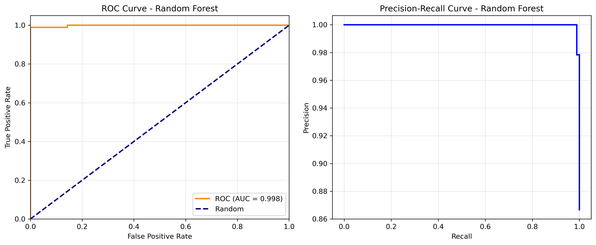
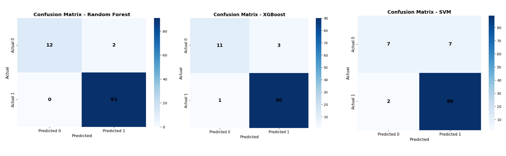
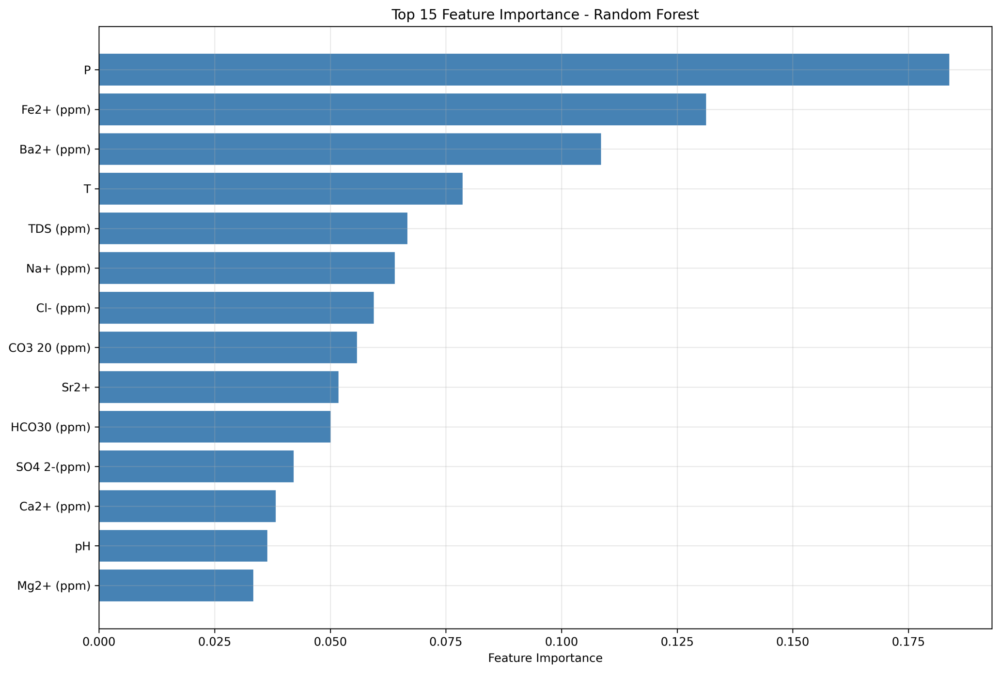
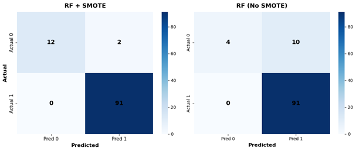
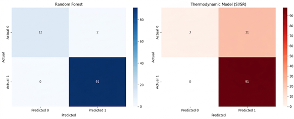

# Scale Prediction: ML vs Thermodynamics

Binary classification of **scale formation** (Inspection Result: 0 = No Scale, 1 = Scale)
in oilfield production systems. The repository combines **machine learning** (Random Forest,
XGBoost, SVM) with a **thermodynamic saturation index/ratio (SI/SR)** model, compares them,
and delivers a production‑ready pipeline tuned with **Optuna** and robust to class imbalance
(via **ADASYN**).

---

## Overview

Scale deposition (calcite, barite, celestite) is a major flow‑assurance challenge. This
project uses a dataset of well conditions (temperature, pressure, pH, ion concentrations) to
predict scale occurrence. The workflow:

- Trains three ML classifiers inside a leakage‑free pipeline (scaling → ADASYN → model)
- Optimises hyperparameters with **Optuna** (maximising ROC‑AUC under 5‑fold stratified CV)
- Applies a **thermodynamic model** based on calcite saturation index, barite and celestite
  saturation ratios
- Provides a comprehensive comparison of predictive performance

---

## Methodology

### Data Preprocessing
- Features: T, P, pH, Ca, Ba, Sr, HCO₃, CO₃, SO₄, and additional fluid properties.
- Target: binary `Inspection Result`.
- Duplicates, missing values, and irrelevant columns are removed.
- Train/test split: 75/25, stratified, `random_state=5`.

### Handling Class Imbalance
**ADASYN** (Adaptive Synthetic Sampling) is applied **only inside the cross‑validation loop**
via `imblearn.pipeline.Pipeline` to prevent data leakage. The same pipeline is used for all
base models.

### Base Models
Three classifiers are independently tuned:

| Model | Library | Hyperparameters Tuned |
|-------|---------|-----------------------|
| Random Forest | `sklearn.ensemble.RandomForestClassifier` | `n_estimators`, `max_depth`, `min_samples_split`, `min_samples_leaf`, `max_features`, `max_samples` |
| XGBoost | `xgboost.XGBClassifier` | `n_estimators`, `max_depth`, `learning_rate`, `subsample`, `colsample_bytree`, `min_child_weight`, `gamma`, `reg_alpha`, `reg_lambda` |
| SVM | `sklearn.svm.SVC` (probability=True) | `C`, `gamma`, `kernel` (and `degree` for poly) |

### Hyperparameter Optimisation
**Optuna** (TPE sampler) runs 5 trials per model, maximising mean **ROC‑AUC** across
5‑fold stratified CV. The best hyperparameters are used for final evaluation.

### Thermodynamic Model
Physics‑based predictions are computed on the test set:

- **Calcite SI** = log₁₀( [Ca²⁺]·[CO₃²⁻] ) – logKsp₍T₎  
- **Barite SR** = ( [Ba²⁺]·[SO₄²⁻] ) / Ksp_barite  
- **Celestite SR** = ( [Sr²⁺]·[SO₄²⁻] ) / Ksp_celestite  

Scale is predicted if **any** of the three indices indicates scaling (SI > 0 or SR > 1).
A pseudo‑probability is constructed for ROC‑AUC evaluation.

---

## Key Results

### 1. ML Model Comparison (With ADASYN)
After optimisation, all models are evaluated on the untouched test set. The bar chart below
compares accuracy, F1 (weighted), and ROC‑AUC. The best model (highest ROC‑AUC) is selected.

### 2. Confusion Matrices – All Models
Side‑by‑side confusion matrices show how each classifier distinguishes between scale and
no‑scale incidents.

### 3. Feature Importance
Gain‑based feature importance is extracted for the tree‑based models (Random Forest &
XGBoost). The top 15 features are displayed; they highlight the most influential
physicochemical parameters.

### 4. ADASYN Impact
A direct comparison of each model with and without ADASYN shows how synthetic oversampling
improves performance (especially F1 and ROC‑AUC) on the minority class.

### 6. Final Showdown: Random Forest vs Thermodynamics
The concluding comparison puts the best ML model (often Random Forest) head‑to‑head with
the thermodynamic rules. The side‑by‑side confusion matrices reveal the trade‑offs between
data‑driven and physics‑based approaches.

*Insert the SI/SR distribution plot generated by the script.*

---

## Repository Structure
